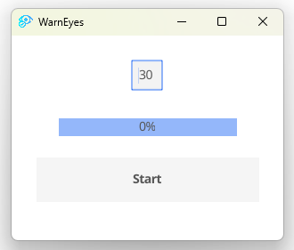

# WarnEyes

A simple application that will notify the user when he has to take a break.



By default the timer is set to 30 minutes.
When the end of the timer is reached a notification will be sent to the user (on Linux or Windows) and a sound will be played.
The timer automatically restart after that. You can stop it to take your break or let it continue if you want to work longer.

After the pause, you can restart the timer by clicking on the "Start" button.

# Installation

If you want to compile the application yourself, you need to install :
- go https://golang.org/dl/
- fyne https://pkg.go.dev/fyne.io/fyne/v2 or `go install fyne.io/fyne/v2/cmd/fyne`

### Bundling ressource
Convert the notif.mp3 ressource to a go file
```bash
fyne bundle -o bundled.go notif.mp3
```	

### Compile the application
```bash
go build .
```
The generated binary will be named `warnEyes.exe` on windows and `warnEyes` on linux. But it is not wrapped as an application with the icon.
To have the final application, run

For windows:
```bash
fyne package -os windows -icon eye.png
```
For linux:
```bash
fyne package -os linux -icon eye.png
```

### Download the application
You can download the application from the [release page](https://github.com/SKnight-s/warnEyes/releases).